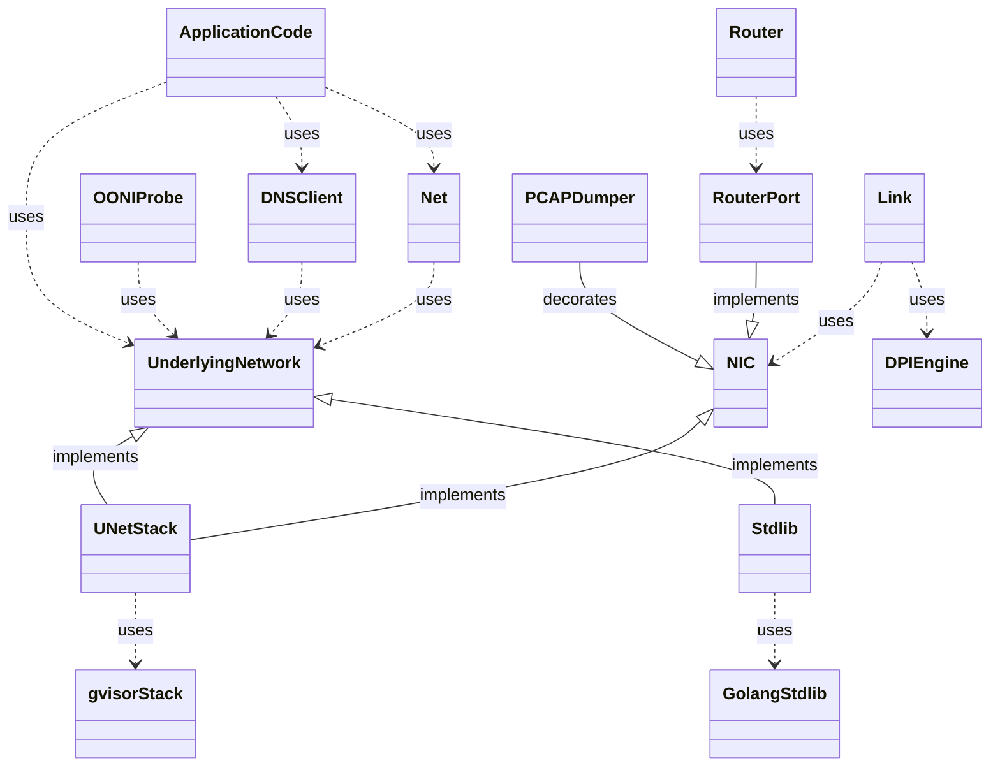

# Netem architecture

The most important struct in this library is
[UNetStack](https://pkg.go.dev/github.com/ooni/netem#UNetStack). It
wraps a [Gvisor](https://gvisor.dev/)-based TCP/IP stack in
userspace and it defines the boundary between the application and
the emulated network stack.

Seen from above a [UNetStack](https://pkg.go.dev/github.com/ooni/netem#UNetStack)
is an [UnderlyingNetwork](https://pkg.go.dev/github.com/ooni/netem#UNetStack), the
interface on which networking code depends in [ooni/probe-cli](
https://github.com/ooni/probe-cli). On top of the [UnderlyingNetwork](
https://pkg.go.dev/github.com/ooni/netem#UNetStack), we define
abstractions that simplify _using_ this library. For example, the
[Net](https://pkg.go.dev/github.com/ooni/netem#Net) struct uses an
[UnderlyingNetwork](https://pkg.go.dev/github.com/ooni/netem#UNetStack)
and provides replacements for functions commonly found in Go
codebases (e.g., the [Dialer](https://pkg.go.dev/net#Dialer) and
the [Resolver(https://pkg.go.dev/net#Resolver)]).

Seen from below, instead, a [UNetStack](https://pkg.go.dev/github.com/ooni/netem#UNetStack)
is a [NIC](https://pkg.go.dev/github.com/ooni/netem#NIC), the Go
interface used by code connecting userspace TCP/IP stacks together. In
particular, we should mention:

1. the [Link](https://pkg.go.dev/github.com/ooni/netem#Link), which
sends IP packets between two [NIC](https://pkg.go.dev/github.com/ooni/netem#NIC)s,
emulates latency, packets losses, and censorship attempts. Using
a [Link](https://pkg.go.dev/github.com/ooni/netem#Link), one can create
point-to-point topologies connecting [NIC](
https://pkg.go.dev/github.com/ooni/netem#NIC)s.

2. the [Router](https://pkg.go.dev/github.com/ooni/netem#Router), which
allows to create more complex network topologies.

The following diagram illustrates the relationship between
important structs and interfaces in netem.

The [DNSClient](https://pkg.go.dev/github.com/ooni/netem#DNSClient) is
an example of high-level code using an
[UnderlyingNetwork](https://pkg.go.dev/github.com/ooni/netem#UnderlyingNetwork)
to perform DNS lookups. The [PCAPDumper](
https://pkg.go.dev/github.com/ooni/netem#PCAPDumper) instead decorates
an existing [NIC](https://pkg.go.dev/github.com/ooni/netem#NIC) to
collect PCAP traces.

The [Stdlib](https://pkg.go.dev/github.com/ooni/netem#Stdlib) struct
implements the [UnderlyingNetwork](https://pkg.go.dev/github.com/ooni/netem#UnderlyingNetwork)
model using the Go standard library rather than [Gvisor](https://gvisor.dev/). Therefore,
code depending on [UnderlyingNetwork](https://pkg.go.dev/github.com/ooni/netem#UnderlyingNetwork)
can use both the Internet and TCP/IP stacks in userspace.

The most complex bit of this implementation is [Link](
https://pkg.go.dev/github.com/ooni/netem#Link) because we need
to emulate network behavior reasonably enough for [Gvisor](https://gvisor.dev/)
TCP/IP implementation to behave similarly to what TCP would
do in normal network (not in terms of performance, rather in
terms of behavior, e.g., fast recovery).
