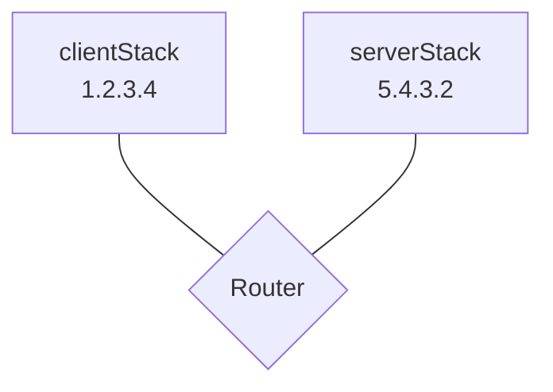

# Netem

[](https://github.com/ooni/netem/actions/workflows/alltests.yml) [](https://pkg.go.dev/github.com/ooni/netem) [](https://coveralls.io/github/ooni/netem?branch=main) [](https://slack.openobservatory.org/)

Netem allows writing integration tests in Go where networking code
uses [Gvisor](https://gvisor.dev/)-based networking. Netem also
includes primitives to emulate link latency, losses, and internet
censorship (null routing, SNI-based blocking, throttling). Using
netem, one can easily simulate complex integration testing scenarios.

## Install instructions

_We currently support go1.19_.

To add netem as a dependency, run:

```bash
go get -u -v -d github.com/ooni/netem
```

This command will download netem and update your `go.mod` and `go.sum`.

## Running tests

```bash
go test ./...
```

## Usage

Existing Go code needs to be adjusted to support netem.

Suppose you have this Go code:

```Go
func yourCode(ctx context.Context) error {
	addrs, err := net.DefaultResolver.LookupHost(ctx, "www.example.com")
	// ...
}
```

You need to convert this code to use netem:

```Go
func yourCode(ctx context.Context, nn *netem.Net) error {
	addrs, err := nn.LookupHost(ctx, "www.example.com")
	// ...
}
```

Normally, you would create a [netem.Net](
https://pkg.go.dev/github.com/ooni/netem#Net) like this:

```Go
nn := &netem.Net{
	Stack: &netem.Stdlib{},
}
```

Your code will still work as intended. But, now you have the
option to replace the `Net` underlying stack with an userspace
TCP/IP network stack, for writing integration tests.

Let us do that. We start by creating a [StarTopology](
https://pkg.go.dev/github.com/ooni/netem#StarTopology):

```Go
topology, err := netem.NewStarTopology(&netem.NullLogger{})
if err != nil { /* ... */ }

defer topology.Close()
```

Then, we use [AddHost](https://pkg.go.dev/github.com/ooni/netem#StarTopology.AddHost)
to add two userspace network stacks to such a topology:

```Go
clientStack, err := netem.AddHost(
	"1.2.3.4",            // stack IPv4 address
	"5.4.3.2",            // resolver IPv4 address
	&netem.LinkConfig{},  // link with no delay, losses, or DPI
)
if err != nil { /* ... */ }

serverStack, err := netem.AddHost(
	"5.4.3.2",            // stack IPv4 address
	"5.4.3.2",            // resolver IPv4 address
	&netem.LinkConfig{},  // link with no delay, losses, or DPI
)
if err != nil { /* ... */ }
```

We now have the following topology:



Now, we can create a [DNSServer](
https://pkg.go.dev/github.com/ooni/netem#DNSServer)
on `5.4.3.2` as follows:

```Go
dnsCfg := netem.NewDNSConfig()
dnsCfg.AddRecord(
	"www.example.com",
	"",                 // empty CNAME
	"5.6.7.8",
)

dnsServer, err := netem.NewDNSServer(
	&netem.NullLogger{},
	serverStack,
	"5.4.3.2",
	dnsCfg,
)
if err != nil { /* ... */ }
```

Finally, we create a [netem.Net](
https://pkg.go.dev/github.com/ooni/netem#Net) as follows:

```Go
nn2 := &netem.Net{
	Stack: clientStack,
}
```

and we can test `yourCode` as follows:

```Go
func TestYourCode(t *testing.T) {
	// ... create nn2 ...
	err := yourCode(context.Background(), nn2)
	if err != nil {
		t.Fatal(err)
	}
}
```

This test will test your code using the above
network stacks and topology.
