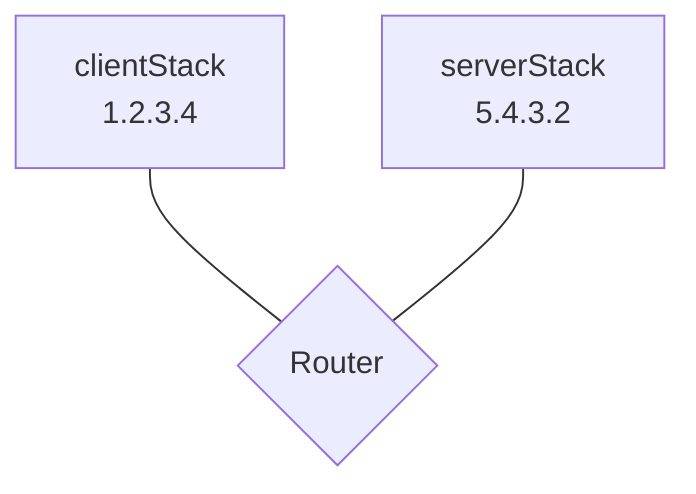

# Netem

[](https://pkg.go.dev/github.com/ooni/netem/v3) [](https://coveralls.io/github/ooni/netem?branch=main) [](https://slack.openobservatory.org/)

> Network emulation for writing integration tests in Go

Netem allows writing integration tests where networking Go code is attached
to a [Gvisor](https://gvisor.dev/)-based userspace TCP/IP stack and
communicates with servers written in Go and running in other userspace
network stacks. Netem provides primities allowing one to connect
those network stacks together through links and routers. Links optionally
have round-trip time and packet loss rate constraints. You can also
configure DPI rules to selectively drop packets, inject RST segments
or throttle flows. Routers allow you to connect multiple TCP/IP
stacks together and form more complex topologies.

## Install instructions

_We currently support go1.19_.

To add netem as a dependency, run:

```bash
go get -u -v -d github.com/ooni/netem
```

This command will download netem and update your `go.mod`
and `go.sum` files such that netem is a dependency.

## Running tests

```bash
go test ./...
```

## Usage

Suppose you have this Go code:

```Go
func yourCode(ctx context.Context) {
	addrs, err := net.DefaultResolver.LookupHost(ctx, "www.example.com")
	// ...
}
```

You need to convert this code to use netem:

```Go
func yourCode(ctx context.Context, nn *netem.Net) {
	addrs, err := nn.LookupHost(ctx, "www.example.com")
	// ...
}
```

Normally, you would create a `netem.Net` like this:

```Go
nn := &netem.Net{
	Stack: &netem.Stdlib{},
}
```

Let us now write a test case for `yourCode`. We need to create
a network topology and poplate it with servers first:

```Go
topology, err := netem.NewStarTopology(&netem.NullLogger{})
if err != nil { /* ... */ }

defer topology.Close()

clientStack, err := netem.AddHost(
	"1.2.3.4",            // stack IPv4 address
	"5.4.3.2",            // resolver IPv4 address
	&netem.LinkConfig{},  // link with no delay, losses, or DPI
)
if err != nil { /* ... */ }

serverStack, err := netem.AddHost(
	"5.4.3.2",            // stack IPv4 address
	"5.4.3.2",            // resolver IPv4 address
	&netem.LinkConfig{},  // link with no delay, losses, or DPI
)
if err != nil { /* ... */ }
```

We now have the following topology:



The `clientStack` and `serverStack` are userspace TCP/IP stacks
connected by a `Router` inside the topology.

Now, we can create a DNS resolver on `5.4.3.2` as follows:

```Go
dnsCfg := netem.NewDNSConfig()
dnsCfg.AddRecord(
	"www.example.com",
	"",                 // CNAME
	"5.6.7.8",
)

dnsServer, err := netem.NewDNSServer(
	&netem.NullLogger{},
	serverStack,
	"5.4.3.2",
	dnsCfg,
)
if err != nil { /* ... */ }
```

Finally, we create a `netem.Net` as follows:

```Go
nn := &netem.Net{
	Stack: clientStack,
}
```

By passing this `nn` to `yourCode`, we can execute
`yourCode` using the userspace network stacks we
just created above.
